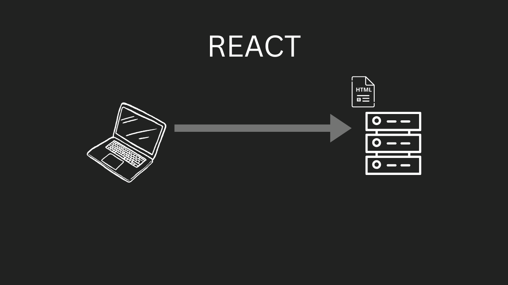
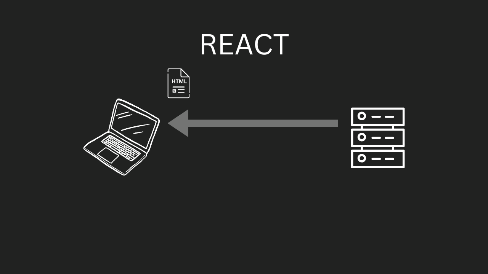
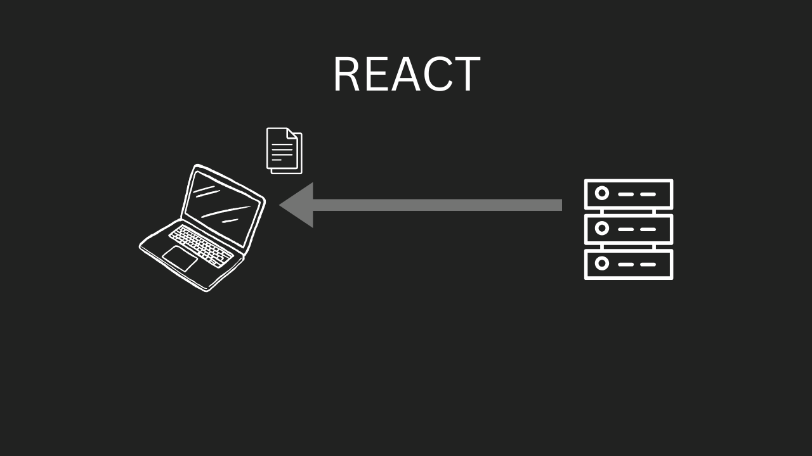
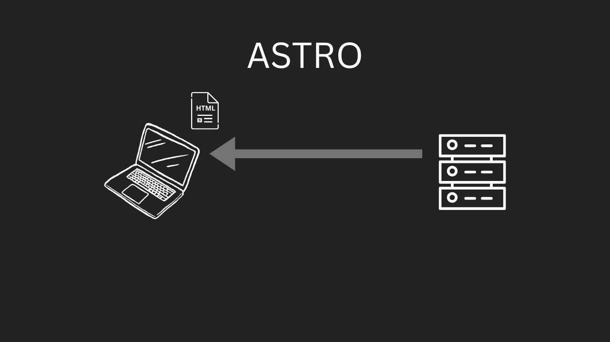

I originally built my personal portfolio site in vanilla React. That's right, just React. No Next.js, no Gatsby, no frameworks at all. At the time I wasn't concerned about SEO. I simply had a vision of what I was wanting and wanted a reason to play with react router. The implications on my site's SEO performance were not lost to me, and I knew I would be rebuilding when the time came.  

After a while I started entertaining the thought of starting a blog. I realized that the time to take the SEO of my site seriously had come, and I was dreading the thought of converting it to Next.js. Not that Next is bad, it just wasn't for me. From past projects working with Next it always felt over engineered.

**Then I learned about Astro.**  

I was intrigued to say the least. After a few projects with Next, Astro seemed different to me. It brought simplicity back into the picture. I knew Astro would be a great fit for my site. All I needed to do was get to work and see if it would be a good fit for me.   

I rebuilt my site over a few evenings. The transition was actually pretty easy. I then compared the Lighthouse SEO score of my React site against my improved Astro site. The difference was astounding! Here are the ratings:  

**React metrics**  
  
**Astro metrics**  
  

## What is the difference between React and Astro?

### React
React is a JavaScript UI library for building stateful applications with a client side architecture. Everything is run by and controlled by JavaScript. Even page routing, which is traditionally done on the server is handled by the client. This means that applications built with React have a considerable speed gain, as there's no need for network requests to update state or navigate between pages.

**There is an issue with React though**. This issue stems from React's client side architecture. To understand this we need to look at how the client and server interact for a React application, and what steps the client takes in rendering the content.

Here's what a browser's interaction with a React app typically looks like:

**The client (a browser in this case) makes a request to the server for the webpage**


**The server responds with the html**


**The client reads the HTML and sees that it needs the JavaScript and makes a request for that**


**The server responds with the JavaScript**


**Upon receiving the JavaScript the client runs it and by doing so generates the UI**

Here we find the issue with React. You see, because every UI component is created and managed by JavaScript, there is little to no HTML for a web crawler to index for SEO. Here is an example of the HTML that a server sends when you make a request to a React app.

```html
<!doctype html>
<html lang="en">
  <head>
    <meta charset="utf-8" />
    <meta name="viewport" content="width=device-width, initial-scale=1, shrink-to-fit=no" />
    <meta name="theme-color" content="#000000" />
    <title>Hello World</title>
  </head>
  <body>
    <noscript>
      You need to enable JavaScript to run this app.
    </noscript>
    <div id="root"></div>
  </body>
</html>
```

This means that when a web crawler tries to visit our page there is no content for it to index. Although there have been some improvements to these crawlers (especially GoogleBot) to where they can run some JavaScript, they were not designed to render whole React sites. They were designed to parse html and index it. To further compound the problem, routing is done on the client for these apps and that makes the issue worse.  

This is where Astro takes an completely different approach.  

### Astro

Astro is a JavaScript framework that works in tandem with React and other UI libraries like Svelte, Angular, and Vue. It can be used in different ways but excels at static site generation (SSG). When using Astro for SSG, it generates every page at build time and has it ready on the server or CDN for when a client requests it. This saves the client from having to build the page before rendering it to the end user.

Let's take a look at a browser's interaction with an Astro app, and see this process in detail.

**The client (a browser in this case) makes a request to the server for the webpage**


**The server responds with the html**


**Upon receiving the html the client can immediately render it for the user**

This is what makes SSG and Astro a game changer for SEO. Because the server responds with ready to use html, a web crawler can get to work on indexing it right away!

## React Components vs Astro Components
Converting my site from React to Astro wasn't all that hard. I just had to convert each react component file to the Astro equivalent. Since Astro works with react I was able to keep any components I had with complex state as React components. Here is an example of a user card component built with React and Astro to show the similarities:

**React**
```jsx
function UserCard({ username, email }) {
  return (
    <div style='user-card'>
      <h2>{username}</h2>
      <p>{email}</p>
    </div>
  );
}

export default UserCard;

```

**Astro**
```astro
---
const { username, email } = Astro.props;
---

<div class="user-card">
  <h2>{username}</h2>
  <p>{email}</p>
</div>
```

As you can see, the translation from one to the other is pretty easy.

## When to use one over the other

It seems like people are using Next.js for everything these days. I personally feel like it's overkill for most projects, but I'll argue that point another time. I think those same projects would often be a better fit for React or Astro. But how do we pick between React and Astro? I think it really just depends on what you are building, and whether or not SEO matters for the project. If you need SEO then Astro might be a great fit! If SEO isn't a priority, then not only is React good enough to get the job done, but the client side speed trade-offs make it a great option!

## Conclusion

I hope this serves as a reminder that as developers, we need to be flexible when designing the architecture of our projects. We need to pick "the right tool for the right job". We don't need to fear new technologies. The transition from React to Astro was daunting at first, but I picked it up quickly. I hope this inspires you to try something new. Maybe it's Astro, or maybe it's something else that solves the problem you are facing.
