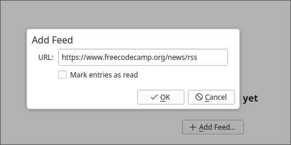
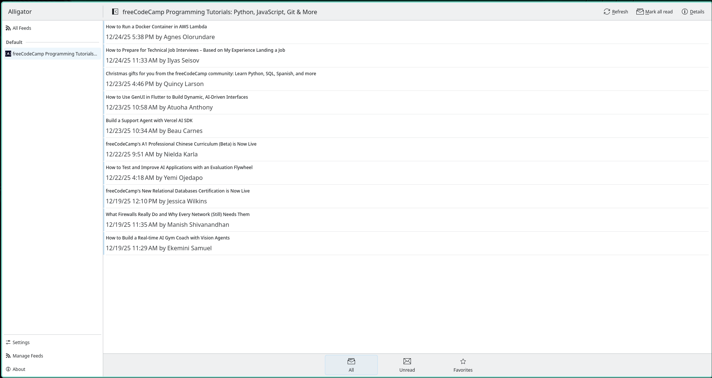
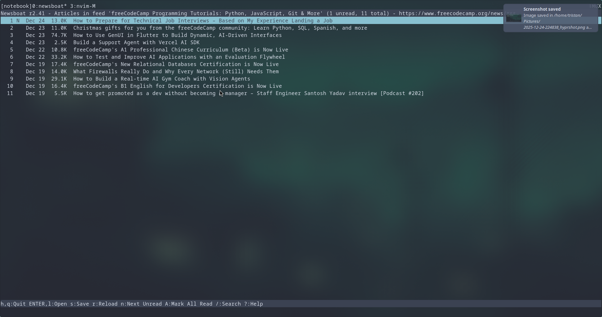
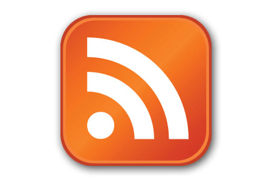

I recently discovered RSS. It's not a new technology. In fact, it's over 25 years old! This technology offers a way to maintain focus and cut through the noise of the modern internet. It lets you follow your interests and stay on top of news without having to use social media. And better yet, there are no algorithms or ads fighting for your attention. This tool has a lot to offer and has already given me a big productivity boost.

## What is RSS?
RSS stands for "Really Simple Syndication". It is a standardized XML format used to syndicate web content. It is used primarily to broadcast blogs and podcasts. If you want to see what this format looks like, here is an example:

[FreeCodeCamp's RSS Feed](https://www.freecodecamp.org/news/rss)

As you can see, the RSS feed is an XML document that contains blog content. You can see individual posts and links to the posts.

## What makes RSS valuable?
So, what is so special about these RSS endpoints? Well, you can subscribe to them via an **RSS reader**. Let's say you enjoy reading from 10 different blogs. How do you stay on top of reading their posts as they roll out? Do you sign up for email updates, and then ignore them after you get hit with dozens of marketing emails? With an RSS reader you can get them all sent to one place that you can check at your leisure. It's like social media, but without an algorithm trying to brainwash you... Another huge perk is that there are no ads. You only get what you sign up for!

## How to use RSS
How do you use an RSS reader? It's super simple. All you have to do is download an RSS reader, and paste in the RSS feed links that you want to follow. I will show you how to do this using two methods. One using a GUI (Alligator), and one using the CLI (Newsboat). I'm on a quest to become a terminal ninja, so I personally prefer Newsboat.

### Using a GUI (Alligator)

[Alligator](https://github.com/KDE/alligator) is a GUI (Graphical User Interface) RSS reader for Linux. After installing Alligator, you will need to click on the **Manage Feeds** option in the bottom left corner.

  

You can then add a new feed to your subscriptions. You paste in the feed that you want to follow. 

> You have the option to mark all of the existing posts in the feed as read. 

  

Your new feed will automatically be loaded in. If you've ever used email then you already know how to use RSS. You will see your feeds in the inbox. You can toggle between **All** and **Unread** feeds. You can also mark articles as favorites to save for later.

  

### Using the CLI (Newsboat)
If you like to stay in the terminal, then [Newsboat](https://newsboat.org/index.html) is for you! 

You can install Newsboat via snap, or build it from source. I'm going to use snap for this demo.

```bash
$ sudo snap install newsboat
```

After installing you need to add any feeds you want to follow to the `~/.newsboat/urls` file. Here is my **urls** file for example,

```txt
https://jamesclear.com/feed
https://www.omglinux.com/feed/
https://powerbi.microsoft.com/en-us/blog/feed/
https://nodejs.org/en/feed/blog.xml
https://blog.boot.dev/index.xml
https://www.freecodecamp.org/news/rss
https://www.alexhyett.com/feed/feed.rss.xml
https://feeds.feedburner.com/TheHackersNews
https://www.bleepingcomputer.com/feed
```

Newsboat will check this file and load the RSS feeds. Now that you have some feeds to start with you can run the application.

```bash
newsboat
```

  

When Newsboat starts you can hit **shift + R** to load your feeds.

> There is a status bar at the bottom of the screen that tells you what the controls are.

Simply navigate the list with your up/down arrows and hit enter to read.

#### Customizing Newsboat
Newsboat is highly configurable. If you want to specify a browser you can. You can even use [W3M](https://w3m.sourceforge.net/)! You can also specify keybindings and color themes. I have mine set up to use Vim keybindings (I use Neovim btw) and W3M for the browser.

```txt
# -- Base Configuration -------------------------------------------------------------------

# Use multiple threads to download all the news faster.
reload-threads 11

# Set default browser
browser "/usr/local/bin/w3m %u"

# -- display -------------------------------------------------------------------

# Hide feeds where all the items are read.
show-read-feeds no

feed-sort-order unreadarticlecount-asc

# solarized
color background         default   default
color listnormal         default   default
color listnormal_unread  default   default
color listfocus          black     cyan
color listfocus_unread   black     cyan
color info               default   black
color article            default   default

# highlights
highlight article "^(Title):.*$" blue default
highlight article "https?://[^ ]+" red default
highlight article "\\[image\\ [0-9]+\\]" green default

text-width 50


# -- navigation ----------------------------------------------------------------

# unbind keys
unbind-key j
unbind-key k
unbind-key J
unbind-key K
unbind-key ^D
unbind-key ^U
unbind-key o
unbind-key g
unbind-key G

# bind keys - vim style
bind-key j down
bind-key k up
bind-key l open
bind-key h quit
bind-key ^D pagedown
bind-key ^U pageup
bind-key U toggle-show-read-feeds
bind-key u show-urls
bind-key g home
bind-key G end
bind-key b open-in-browser-and-mark-read
bind-key B open-in-browser
bind-key i sort
bind-key I rev-sort
```

## How to find RSS Feeds
So how do you find RSS feeds? Since social media kept RSS from becoming mainstream, it's not always clear if a website offers an RSS stream. There are a couple of ways to check though.

### The RSS Icon

Sometimes an RSS feed will be openly advertised. You will sometimes stumble on the RSS icon on a site. This is normally found with other social links or in the footer of the site.

  

### Hacking the URL Endpoints
You can try changing the URL in the address bar. Let's say you are on **example.com**, and you want to add it to your RSS feed. You can change the URL to the following to see if one leads to an RSS stream.

- example.com/feed
- example.com/blog/feed
- example.com/rss
- example.com/blog/rss
- example.com/blog/xml
- example.com/xml
- example.com/index.xml

### Viewing Page Source
As a last resort, you can view the page source by right-clicking the page, and selecting "view source". This will open the HTML of the web page. You can use CTRL + F to open up search mode and you can look for the keywords "RSS" and "XML". Sometimes the RSS feed will be listed there.

## Conclusion
RSS is a powerful tool. You can use it to craft an environment tailored to your interests and needs without the distraction of social media. I find that it saves me a lot of time not having to go to each blog/podcast individually. I have one more wild fact to leave you with. YouTube has RSS feeds for individual channels. You can subscribe to your favorite YouTubers and stay up to date on their content from your RSS reader!

`https://www.youtube.com/feeds/videos.xml?channel_id=CHANNEL_ID`

